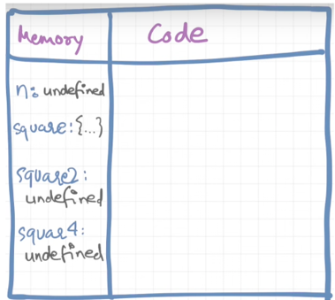
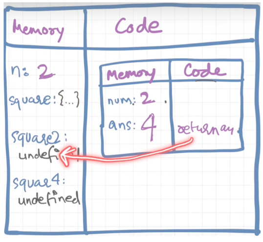
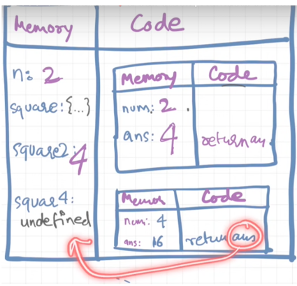

# How Javascript Code is executed? & Call Stack

- When a JS program is run, a global execution context is created.
- The execution context is created first when we run a JS program. In which it creates two phases.
  - Memory creation phase (Creation Phase)
  - Code execution phase
- For Ex-

```javascript
var n = 2;
function square(num) {
  var ans = num \* num;
  return ansi
}
var square2 = square(n);
var square4 = square (4);
```

- At first memory creation phase will work and allocates the memory to the variable and fuctions, for variable is stores undefined and for functions it stores the whole code of function.
- Undefined is like a placeholder in JS, a special keyword in JS.
- The output of first face looks like this:-

  

### Now, Code execution phase will comes into the scene and run the code line by line.

- As soon as it encounters first line `n = 2;`, it places the 2 inside n.
- When it comes to the line 2, there is nothing to do it skips the whole function.
- Now, in line 6 the function is invoked, function in JS is like a mini program and whenever a function is invoked a new execution context is created for that function.
- Then in code execution phase the value of i.e. 2 is passed to num and in next line the value of ans is calculated and replaced in stored memory allocation. When we move to next line return tells this function that you are done with your work and return control where the function was invoked.
- Now the whole execution context of that function will be deleted.

  

- Now when we move to the next line again function is invoked, again a brand new execution context is created and same will be repeated.

  

### Additional Points

- JavaScript handles everything to manage this execution context creation and deletion with the help of CALL STACK.
- Call Stack maintains the order of execution of the execution contexts.
- It is also known as Program Stack, Control Stack, Runtime stack, Machine Stack, Execution context stack.
