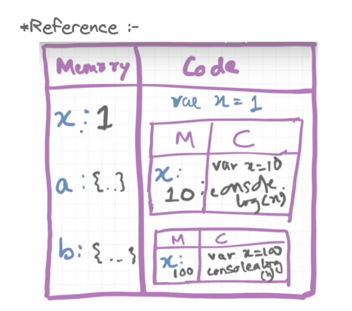

# How Function works in JS ❤️

## In this we explore more about function and variable env :-

```js
var x = 1;
a();
b(); // we are calling the functions before defining them. This will work properly, as seen in Hoisting.
console.log(x); // 3

function a() {
    var x = 10; // localScope because of separate execution context
    console.log(x); // 1
}

function b() {
    var x = 100;
    console.log(x); // 2
}
```


```
10   test.js:8:11
100  test.js:13:11
1    test.js:4:9
```

## Code Flow:

- A **Global Execution Context (GEC)** is created, and that GEC is pushed into the CallStack.  
  **CallStack:** `[ GEC ]`

- In the first phase, memory is allocated to `x: undefined`, and for `a` and `b` functions, their entire values are initialized.

- In the second phase, `x` is assigned the value `1`, then `a()` is invoked, and a local execution context is created inside `GEC`.  
  **CallStack:** `[ GEC, a() ]`

- Now, in **Local Execution Context (LEC)**, a totally different `x` variable is assigned `undefined` in memory allocation. Then, during execution, the value of `x` is assigned in LEC as `10`, and `console.log(x)` prints `10`. After this, LEC is closed and removed from CallStack.  
  **CallStack:** `[ GEC ]`

- When the cursor moves to the next line, the same steps will repeat for `b()`.  
  **CallStack:** `[ GEC, b() ]`

- After printing `100` at line `13`, the LEC of `b()` is removed from CallStack.  
  **CallStack:** `[ GEC ]`

- Finally, the last `console.log(x)` prints the value of `x` from **GEC**, which is `1`, and then **GEC** is deleted and removed from CallStack.

  


