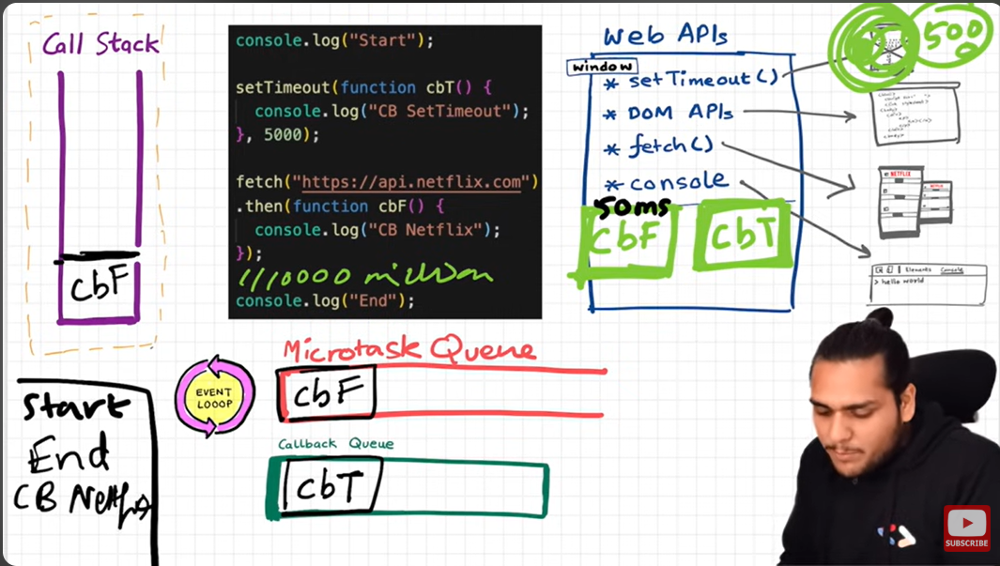

# Asynchronous JavaScript & EVENT LOOP

- So, JS is a single synchronous single-threaded language.
- It has a `Call Stack`; it can do one thing at a time.

- Browser has a `JS engine` which has a `Call Stack` which has a `Global Execution Context` and other `local execution contexts`.
- Browsers also have other superpowers like `local storage`, `Timer`, `Bluetooth access`, `location access `, and so on.
- To access those superpowers, JS needs to connect the call stack with all these superpowers. This is done using Web APIs.

### WebAPIs
None of the below is part of JavaScript! These are extra superpowers that the browser has. The browser gives access to the JS call stack to use these powers.
- setTimeout()
- DOM APIs
- fetch()
- localStorage()
- console
- location

- Browser gave access inside Callstack/JS engine to all these superpowers, because of the global object.
- This global object is `keyword: window`

- Let's understand the below code with an example:


  ```js
    console.log("start");
    setTimeout(function cb() {
      console.log("timer");
    }, 5000);
    console.log("end");
    // start end timer
  ```
  - First, a GEC is created and put inside the call stack.
  - console.log("Start"); // this calls the console web api (through window), which internally actually modifies values in the console.
  - setTimeout(function cb() { //this calls the setTimeout web API, which gives access to the  timer feature. It stores the callback cb() and starts a timer. console.log("Callback");}, 5000);
  - console.log("End"); // calls console api and logs in console window. After this, GEC pops from call stack.
  - While all this is happening, the timer is constantly ticking. After it becomes 0, the callback cb() has to run.
  - Now we need this cb to go into the call stack. Only then will it be executed. For this we need **event loop** and **Callback queue**

## Event Loop and callback queue

### Example 1
- cb() cannot be directly executed. It goes to the callback queue when the timer expires.
- Event loop checks the callback queue and sees if it has any elements to put into the call stack. It is like a gatekeeper.
- Once cb() is in the callback queue, the event loop pushes it to the call stack to run. The console API is used, and log is printed


### Example 2
```js
  console.log("Start");
  document.getElementById("btn").addEventListener("click", function cb() {
    // cb() registered inside webapi environment to the event(click) and attached to it. i.e., REGISTERING A CALLBACK AND ATTACHING EVENT TO IT.
    console.log("Callback");
  });
  console.log("End"); // calls the console api and logs in the console window. After this, GEC gets removed from call stack.
  // In the above code, even after the console prints "Start" and "End" and pops GEC out, the eventListener stays in webapi env(with the hope that the user may click it some day) until explicitly removed, or the browser is closed.
  ```

- Eventloop has just one job: to keep checking the callback queue and if it finds something, push it to the call stack and delete it from the callback queue.

Q: Need for a callback queue?

**Ans**: Suppose user clciks button x6 times. So 6 cb() are put inside the callback queue. Event loop sees if the call stack is empty/has space and whether the callback queue is not empty(6 elements here). Elements of the callback queue are popped off, put in the call stack, executed, and then popped off from the call stack.

### Example 3
```js
console.log("Start"); // this calls the console web api (through window), which in turn modifies values in the console.
setTimeout(function cbT() {
  console.log("CB Timeout");
}, 5000);
fetch("https://api.netflix.com").then(function cbF() {
    console.log("CB Netflix");
}); // take 2 seconds to bring response
// millions lines of code
console.log("End");
```

Code Explanation:
* A GEC is created, console log calls webAPI, prints in console.
* setTimeout will register cbT() in webAPI, then fetch registers cbF into webapi environment along with existing cbT.
* cbT is waiting for 5000ms to end so that it can be put inside the callback queue. cbF is waiting for data to be returned from Netflix servers gonna take 2 seconds.
* After this, millions of lines of code are running. By the time millions of lines of code are executed, 5 seconds have passed, and now the timer has expired, and a response from the Netflix server is ready.
* Data back from cbF ready to be executed gets stored into something called a `Microtask Queue`.
* Also, after the expiration of the timer, cbT is ready to execute in the `Callback Queue`.
* Microtask Queue is the same as `Callback Queue`, but it has higher priority. Functions in the `Microtask Queue` are executed earlier than `Callback Queue`.
* In the console, first Start and End are printed in console. First, cbF goes in the call stack, and "CB Netflix" is printed. cbF popped from the call stack. Next, cbT is removed from the callback Queue, put in the Call Stack, "CB Timeout" is printed, and cbT is removed from the call stack.
* See image below for more understanding

  

#### What enters the Microtask Queue?

- All the callback functions that come through promises go into the microtask queue.
- **Mutation Observer**: Keeps on checking whether there is a mutation in the DOM tree, and if there is, then it executes some callback function.
- Callback functions that come through promises and mutation observer go inside the **Microtask Queue**.
- All the rest goes inside **Callback Queue, aka. Task Queue**.
- If the task in the microtask Queue keeps creating new tasks in the queue, the element in the callback queue never gets a chance to be run. This is called **starvation**

### Some Important Questions

1. **When does the event loop actually start? -** Event loop, as the name suggests, is a single-threaded loop that is _almost infinite_. It's always running and doing its job.

2. **Are only asynchronous web api callbacks registered in the web api environment? -** YES, the synchronous callback functions like what we pass inside map, filter, and reduce aren't registered in the Web API environment. It's just those async callback functions that go through all this.

3. **Does the web API environment store only the callback function and push the same callback to the queue/microtask queue? -** Yes, the callback functions are stored, and a reference is scheduled in the queues. Moreover, in the case of event listeners(for example, click handlers), the original callbacks stay in the web API environment forever; that's why it's advised to explicitly remove the listeners when not in use so that the garbage collector does its job.

4. **How does it matter if we delay for setTimeout would be 0ms? Then the callback will move to the queue without any wait? -** No, there are trust issues with setTimeout() 😅. The callback function needs to wait until the Call Stack is empty. So the 0 ms callback might have to wait for 100 ms also if the stack is busy.
