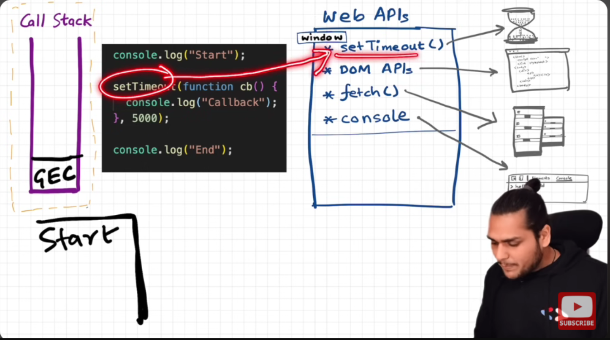
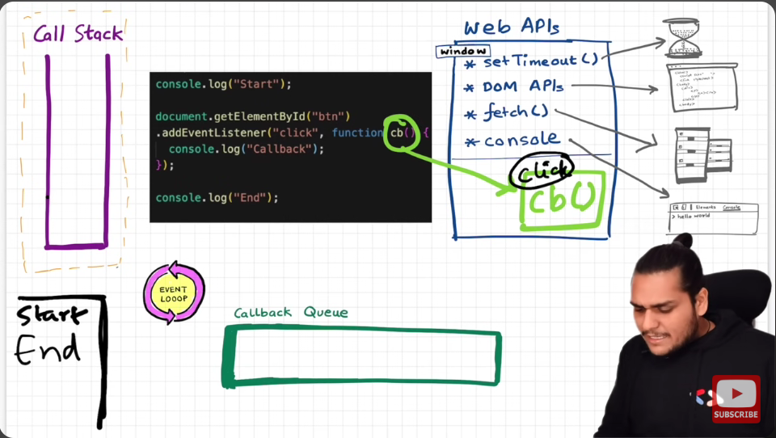

# Asynchronous JavaScript & EVENT LOOP

- So, JS is a single synchronous single-threaded language.
- It has a `Call Stack`; it can do one thing at a time.

- Browser has a `JS engine` which has a `Call Stack` which has a `Global Execution Context` and other `local execution contexts`.
- Browsers also have other superpowers like `local storage`, `Timer`, `Bluetooth access`, `location access `, and so on.
- To access those superpowers, JS needs to connect the call stack with all these superpowers. This is done using Web APIs.

### WebAPIs
None of the below is part of JavaScript! These are extra superpowers that the browser has. The browser gives access to the JS call stack to use these powers.
- setTimeout()
- DOM APIs
- fetch()
- localStorage()
- console
- location

- Browser gave access inside Callstack/JS engine to all these superpowers, because of the global object.
- This global object is `keyword: window`

- Let's understand the below code with an example:


  ```js
    console.log("start");
    setTimeout(function cb() {
      console.log("timer");
    }, 5000);
    console.log("end");
    // start end timer
  ```
  - First, a GEC is created and put inside the call stack.
  - console.log("Start"); // this calls the console web api (through window), which internally actually modifies values in the console.
  - setTimeout(function cb() { //this calls the setTimeout web API, which gives access to the  timer feature. It stores the callback cb() and starts a timer. console.log("Callback");}, 5000);
  - console.log("End"); // calls console api and logs in console window. After this, GEC pops from call stack.
  - While all this is happening, the timer is constantly ticking. After it becomes 0, the callback cb() has to run.
  - Now we need this cb to go into the call stack. Only then will it be executed. For this we need **event loop** and **Callback queue**

## Event Loop and callback queue

### Example 1
- cb() cannot be directly executed. It goes to the callback queue when the timer expires.
- Event loop checks the callback queue and sees if it has any elements to put into the call stack. It is like a gatekeeper.
- Once cb() is in the callback queue, the event loop pushes it to the call stack to run. The console API is used, and log is printed


### Example 2
```js
  console.log("Start");
  document.getElementById("btn").addEventListener("click", function cb() {
    // cb() registered inside webapi environment to the event(click) and attached to it. i.e., REGISTERING A CALLBACK AND ATTACHING EVENT TO IT.
    console.log("Callback");
  });
  console.log("End"); // calls the console api and logs in the console window. After this, GEC gets removed from call stack.
  // In the above code, even after the console prints "Start" and "End" and pops GEC out, the eventListener stays in webapi env(with the hope that the user may click it some day) until explicitly removed, or the browser is closed.
  ```

- Eventloop has just one job: to keep checking the callback queue and if it finds something, push it to the call stack and delete it from the callback queue.
