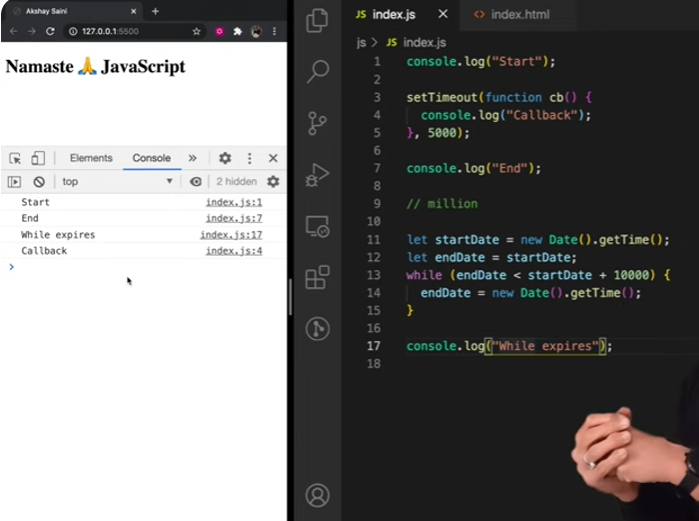

#  TRUST ISSUES with setTimeout

## The Myth of Exact Timing  
When you set a timer with `setTimeout` for 5 seconds, you might expect the callback function to execute **precisely** after 5 seconds. However, that's not always the case—it could be delayed by 6, 7, or even 10 seconds. The reason? **JavaScript’s event loop and call stack behavior.**  

## Understanding the Code  

```js
console.log("Start");

setTimeout(function cb() {
  console.log("Callback");
}, 5000);

console.log("End");

// Imagine there's a huge chunk of code that takes 10 seconds to execute.
```

### How JavaScript Handles This  

1. **Global Execution Context (GEC) Begins**  
   - JavaScript creates the GEC and pushes it onto the call stack.  

2. **Executing the First Logs**  
   - `"Start"` is printed to the console.  

3. **Handling setTimeout**  
   - The callback function `cb` is registered in the **Web API environment** with a timer of 5 seconds.  
   - However, JavaScript doesn’t pause—it keeps executing the next lines of code.  

4. **Executing Further Code**  
   - `"End"` is printed.  
   - Now, let’s assume there are a million lines of code that take 10 seconds to complete. The **call stack remains occupied** with these operations.  

5. **Meanwhile, in the Background...**  
   - The 5-second timer **completes** in the Web API environment.  
   - The callback function moves to the **Callback Queue**, waiting to be executed.  

6. **The Event Loop Steps In**  
   - The event loop constantly checks if the **call stack is empty**.  
   - Since the script is still executing (taking 10 seconds), the callback function **cannot be pushed** to the call stack yet.  

7. **Callback Execution is Delayed**  
   - Only when the **main script finishes** after 10 seconds does the call stack become free.  
   - At that moment, the event loop moves `cb()` from the callback queue to the call stack, and it finally runs.  

## The Takeaway  
Even though we set a **5-second timer**, the callback actually executes **after 10 seconds** because JavaScript’s **single-threaded nature** does not allow it to interrupt the ongoing execution. This is a fundamental part of **JavaScript’s concurrency model** and the **event loop mechanism**.  

## Rule to Remember  
**Never block the main thread!** JavaScript runs on a **single call stack**, meaning that long-running tasks can delay other operations, including `setTimeout` callbacks. Always keep your code efficient to avoid unnecessary delays! 🚀

## Below is an example of blocking the main thread:-
  

- JavaScript ensures that the code inside setTimeout executes only after the specified delay has passed, never before.

- Despite being a single-threaded, synchronous language, JavaScript efficiently runs all code on a single execution thread. It behaves somewhat like an interpreted language, executing quickly in the browser thanks to Just-In-Time (JIT) compilation. Additionally, it provides mechanisms for handling asynchronous operations.

- What if **timeout = 0sec**?
  ```js
  console.log("Start");
  setTimeout(function cb() {
    console.log("Callback");
  }, 0);
  console.log("End");
  // Even though timer = 0s, the cb() has to go through the queue. Registers calback in webapi's env , moves to callback queue, and execute once callstack is empty.
  // O/p - Start End Callback
  // This method of putting timer = 0, can be used to defer a less imp function by a little so the more important function(here printing "End") can take place
  ```
